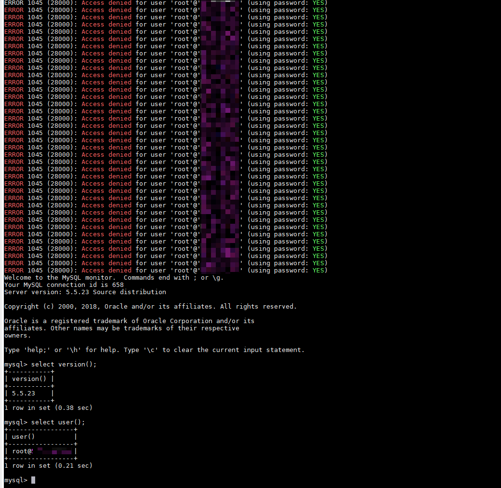

## MySQL 인증 바이패스 취약점 (CVE-2012-2122)

**취약점 설명:**
MariaDB/MySQL에 연결할 때 입력한 암호가 올바른 암호와 비교되어야 하는데, 잘못된 처리로 인해 memcmp()가 비영(0이 아닌) 값을 반환하더라도 MySQL은 두 암호가 동일하다고 인식하게 됩니다. 다시 말해 사용자 이름을 알고 있다면 계속 시도하여 SQL 데이터베이스에 직접 로그인할 수 있는 취약점이 있습니다.

**영향을 받는 버전:**
- MariaDB 버전 5.1.62, 5.2.12, 5.3.6, 5.5.23은 영향을 받지 않습니다.
- MySQL 버전 5.1.63, 5.5.24, 5.6.6은 영향을 받지 않습니다.

**참고 링크:**
- [FreeBuf 블로그 글](http://www.freebuf.com/vuls/3815.html)
- [Rapid7 블로그 글](https://blog.rapid7.com/2012/06/11/cve-2012-2122-a-tragically-comedic-security-flaw-in-mysql/)

**환경 설정:**
테스트를 통해 확인되었으며, 이 환경은 컨테이너 내에서 실행되지만 취약점이 재현되는지는 호스트 시스템에 어느 정도 의존합니다. 호스트 시스템으로는 Ubuntu 또는 Mac 시스템을 선택하는 것이 좋지만 항상 성공적인 결과를 보장하지는 않으며, 더 많은 테스트 결과를 Issue에 제출해주시면 환영합니다.

**취약점 확인:**
환경에서 올바른 암호를 모르는 상태에서 다음과 같은 명령을 실행하면 일정 횟수의 시도 후에 성공적으로 로그인할 수 있습니다:

```bash
for i in `seq 1 1000`; do mysql -uroot -pwrong -h your-ip -P3306 ; done
```

결과

